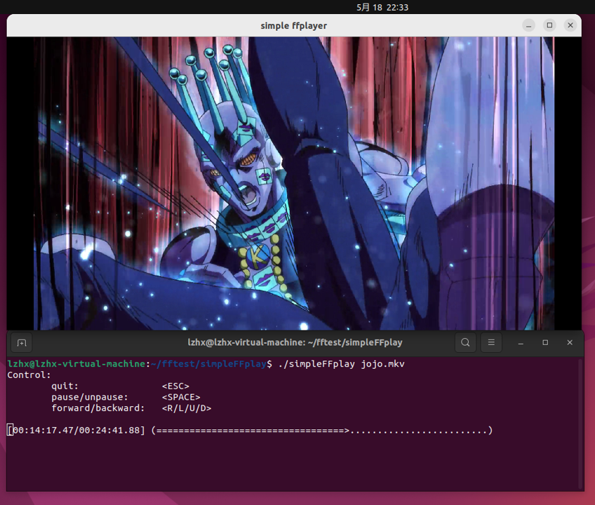

# simpleFFplay

A simpler ffplay based on FFmpeg4 and SDL2, aimed to be a better example for learning media player than "How to Write a Video Player in Less Than 1000 Lines" and pockethook/player, etc. 

**Problems in other player example:**
1. `ffplay.c`: understanding the code for video-audio synchronizing is quite hard. Commandline option parsing, avfilter and subtitle makes it more difficult to read.
2. Some simpler example can only play video stream.
3. Some example use out-of-date FFmpeg API. The FFmpeg API is changing fast and many of them were deprecated.
4. `leichn/ffplayer` is a good example for beginner. But it still has some bugs:
	- It can't quit normally.
	- Pause doesn't work well.
	- AVPacketList is a deprecated structure.
	- Seek is not supported.

`simpleFFplay` is an improved version of the `leichn/ffplayer`. They are all based on ffplay.c from FFmpeg.

**Required FFmpeg version is 4.4.2, and required SDL2 version is 2.0.20. Test system is Ubuntu 22.04. Other environments may work but I haven't test them.**

## Usage

- `pause/unpause`: SPACE
- `>> 10s | << 10s | >>> 60s | <<< 60s`: LEFT | RIGHT | UP | DOWN
- `quit`: ESC

## References
Some very useful materials (not too old) are recommended here:
- [leandromoreira/ffmpeg-libav-tutorial](https://github.com/leandromoreira/ffmpeg-libav-tutorial)
- [FFmpeg/FFmpeg](https://github.com/FFmpeg/FFmpeg)
- [Chinese Blog](https://www.cnblogs.com/leisure_chn/p/10301215.html)

## License
GPLv3 (Inherited from FFmpeg).